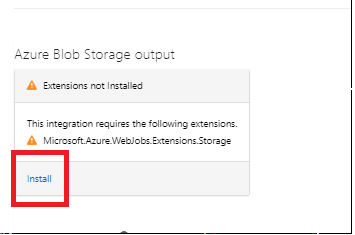

# Creating a Custom Provider with Resources


### Deploy custom provider :
<a href="https://portal.azure.com/#create/Microsoft.Template/uri/https%3A%2F%2Fraw.githubusercontent.com%2FAzure%2azure-custom-providers%2Fmaster%2FSampleFunctions%2FCSharpSimpleProvider%2Fazuredeploy.json" target="_blank">
     
</a>

### Deploy custom provider resource:
<a href="https://portal.azure.com/#create/Microsoft.Template/uri/https%3A%2F%2Fraw.githubusercontent.com%2FAzure%2azure-custom-providers%2Fmaster%2FSampleFunctions%2FCSharpSimpleProvider%2Fazuredeploy.customresource.json" target="_blank">
     
</a>


# Creating an azure function 

In this section is the code required to deploy the azure function that backs the custom resource provider created in the first sample. 

### Deploying the function. 

To see how this function works you can go to azure portal and deploy a new azure function. To do this : 
- Go to "Create a resource"
- Type "Function App"
- Follow the prompts to create a new function app. 

Now we have to create two functions within this app to get the code. To do this go to functions and click on "New function" and select the type as HttpTrigger , finally select the authorization level as anonymous and click create.
Note : For a real world scenario , please consider using the function authorization level to call your function as per your security requirements

Now we have to add a binding to azure blob storage for saving our user data. To do this click on integrate and select new output and click on Azure blob Storage and click ok this should create a warning as below and ask you to install an extenstion. Click install here. 




Once this is done go to the function files and upload and select all the files from "SampleFunction\HttpTrigger1" and upload them 

Similarly do the same for "Samplefunction\HttpTrigger2"


### Using the functions 

You can use the test functions on the side of the functions blade to play with the functions and see how it is setup. 

Please note the following characteristics: 

The routing template for the function looks something like this : 

```
subscriptions/{subscriptionId}/resourcegroups/{resourceGroupName}/providers/Microsoft.CustomProviders/resourceproviders/{minirpname}/{action}/{name}
```

Note that when the  function is called the full ARM resource id of the custom providers is appended in the route to the function. 


### Users function

A sample body input fot the function PUT call os as follows : 

```
{
        {
        "name": "santa",
        "type": "Microsoft.CustomProviders/resourceproviders/users",
        "properties": {
            "FullName": "Santa Claus",
            "Location": "NorthPole"
        }
}
```

Note that the name and type as defined here are required properties for the payload. Any other data will come in the properties section of the body. This is to conform to ARM standards of creating the resources. 

### Ping function
In this case you just need to test the function by calling a POST action with the parameter action set to "ping" with random values for the other inputs. This will return the output of the POST action. 

### Creating a zip fle for deployment of azure function. 
Once you have made any modifications on the azure function you can export it and create a zip. Now update the zip file present in the artifacts folder for the function deployment example. After this running the deployment command will use your exported functions.
